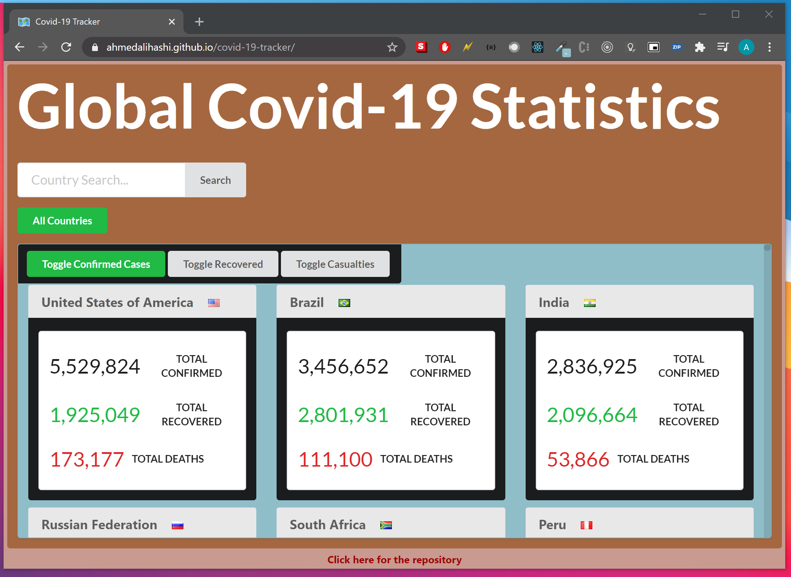
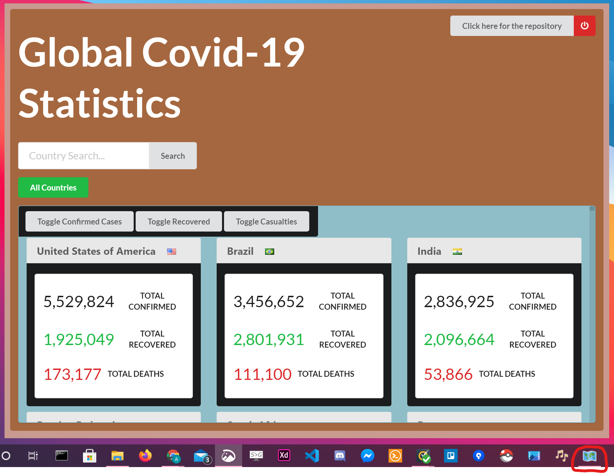

# Covid-19 Tracker

> Live Website: https://ahmedalihashi.github.io/covid-19-tracker/   

> Windows App Version Download [here](https://mega.nz/file/CnYyxahB#cRgI7JtYRQu3Wxbgw7TeGvzi9u4SG41KYycSfuen4oY) (win32 x64)

This web site queries an [api](https://covid19api.com/) for data related to the Covid-19 and displays it for the user.

</img>

## Quick Instructions

To create a light dev version

```
git clone https://github.com/AhmedAlihashi/covid-19-tracker.git
npm install or yarn install
npm run start or yarn start
```

## Windows Application

You can download the pre-built version 

To create a light dev version

```
( If you don't have foreman installed: npm install -g foreman )
git clone https://github.com/AhmedAlihashi/covid-19-tracker.git
npm install or yarn install
npm run start or yarn start
```

Alternativly you can build your own version locally   

```
git clone https://github.com/AhmedAlihashi/covid-19-tracker.git
cd electron
npm install or yarn install
npm run build-win or yarn build~win
```
## ScreenShot

### Website

</img>

### Windows Application

</img>
